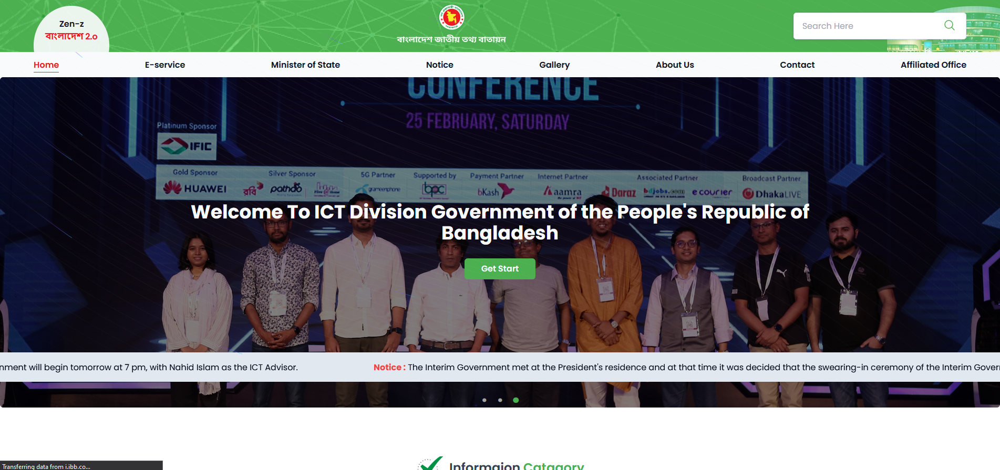

# ICT Division Website Redesign and Rebuild (Demo Project)

This project involves the complete redesign and rebuild of the ICT Division website. Currently, the project includes only the landing page, with more pages and full functionality in development. The goal is to create a fully responsive and visually appealing site using modern web technologies.

## Project Overview

- **Current Status:** Landing page complete (in progress).
- **Upcoming:** Additional pages and full functionality will be implemented soon.

## Tech Stack

- **Frontend Framework:** React (with TypeScript)
- **Styling:** Tailwind CSS
- **Component Library:** Shadcn UI
- **Animations:** Aceternity UI

## Live Preview

You can view the live version of the site [here](https://redesigne-ict-division.vercel.app/).

## Landing Page Preview

